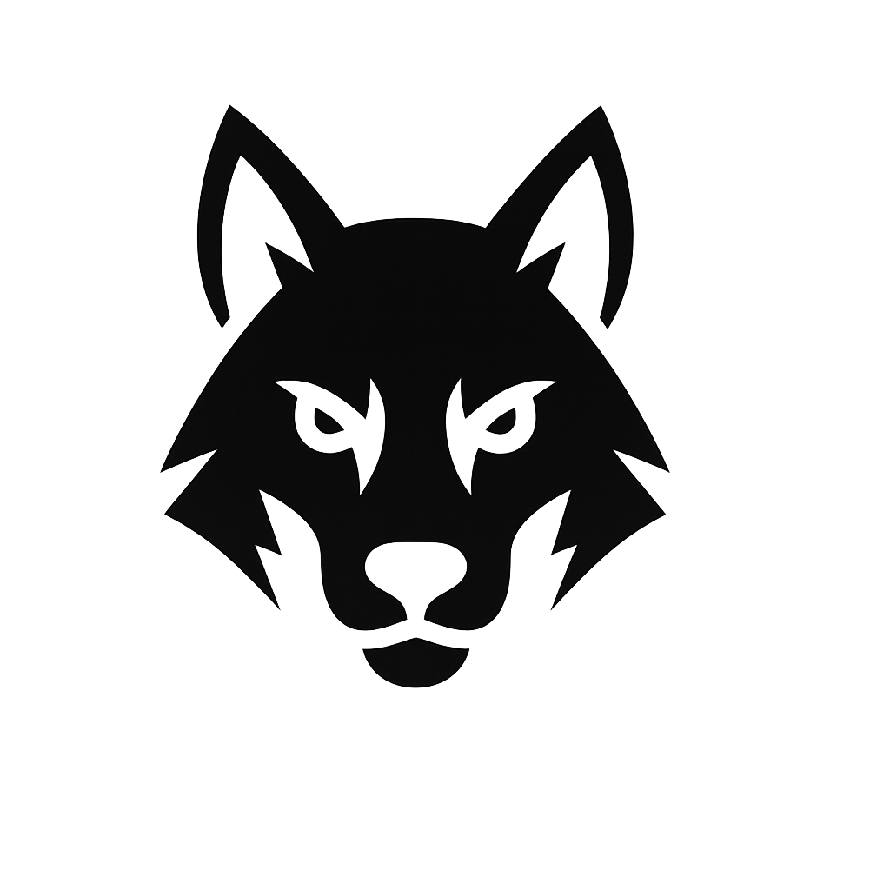

<div align="center">
  
  
  # 🐺 Vulfy
  
  **Fast, cross-language vulnerability scanner that doesn't mess around.**
  
  [](https://github.com/mindPatch/vulfy/releases)
  [](https://opensource.org/licenses/MIT)
  [](https://www.rust-lang.org)
  [](https://github.com/mindPatch/vulfy/actions)
</div>

---

## 🚀 What is Vulfy?

Vulfy is a lightning-fast vulnerability scanner that checks your project dependencies for known security issues across multiple programming languages. Built with Rust for maximum performance, it integrates with the OSV.dev database to provide accurate, up-to-date vulnerability information.

**Why Vulfy?** Born from frustration with slow, bloated security tools that take forever to scan projects. Vulfy gets straight to the point: find vulnerabilities fast, report them clearly, and get out of your way.

## ✨ Features

- 🔥 **Lightning Fast** - Async Rust architecture with concurrent API calls
- 🌍 **Multi-Language Support** - npm, pip, cargo, maven, go, ruby, and more
- 📊 **Flexible Output** - Table, JSON, CSV, SARIF formats for any workflow
- 🎯 **OSV.dev Integration** - Real vulnerability data from Google's Open Source Vulnerabilities database
- ⚡ **Zero Configuration** - Works out of the box with sensible defaults
- 🔄 **CI/CD Ready** - Perfect for automated security pipelines
- 🎨 **Beautiful Reports** - Color-coded severity levels and clean formatting

## 📦 Installation

### Pre-built Binaries
```bash
# Download the latest release for your platform
curl -LO https://github.com/mindPatch/vulfy/releases/latest/download/vulfy-linux-x86_64.tar.gz
tar -xzf vulfy-linux-x86_64.tar.gz
sudo mv vulfy /usr/local/bin/
```

### From Source
```bash
git clone https://github.com/mindPatch/vulfy.git
cd vulfy
cargo build --release
sudo cp target/release/vulfy /usr/local/bin/
```

### Using Cargo
```bash
cargo install vulfy
```

## 🏃‍♂️ Quick Start

### Basic Scan
```bash
# Scan current directory with beautiful table output
vulfy scan packages

# Scan specific directory
vulfy scan packages --path /path/to/project
```

### CI/CD Integration
```bash
# JSON output for programmatic use
vulfy scan packages --format json --output security-report.json

# SARIF format for GitHub Security tab
vulfy scan packages --format sarif --output vulfy.sarif

# Exit with error code if high-severity vulnerabilities found
vulfy scan packages --high-only --quiet
```

## 🛠️ Usage

```bash
vulfy scan packages [OPTIONS]

OPTIONS:
    -p, --path <PATH>              Directory to scan [default: current directory]
    -f, --format <FORMAT>          Output format: table, json, csv, summary, sarif [default: table]
    -o, --output <FILE>            Write output to file instead of stdout
    -e, --ecosystems <LIST>        Scan specific ecosystems only (npm,pypi,cargo,maven,go,ruby)
    -q, --quiet                    Suppress progress messages
        --high-only                Show only high and critical severity vulnerabilities
        --no-recursive             Don't scan subdirectories
        --no-dev-deps              Skip development dependencies
        --timeout <SECONDS>        API request timeout [default: 30]
        --max-concurrent <N>       Maximum concurrent API requests [default: 10]
```

## 🎯 Supported Ecosystems

| Language | Package Files | Lock Files |
|----------|---------------|------------|
| **JavaScript/Node.js** | `package.json` | `package-lock.json`, `yarn.lock`, `pnpm-lock.yaml`, `npm-shrinkwrap.json` |
| **Python** | `requirements.txt`, `setup.py`, `setup.cfg`, `pyproject.toml` | `Pipfile.lock`, `poetry.lock`, `environment.yml` |
| **Rust** | `Cargo.toml` | `Cargo.lock` |
| **Java** | `pom.xml`, `build.gradle`, `build.gradle.kts`, `ivy.xml` | - |
| **Go** | `go.mod`, `go.work` | `go.sum`, `go.work.sum`, `vendor/modules.txt` |
| **Ruby** | `Gemfile`, `gems.rb`, `*.gemspec` | `Gemfile.lock` |

## 📋 Example Output

### Table Format (Default)
```
🔍 Scanning for package files...
📦 Found 6 package files across 4 ecosystems

🛡️  VULNERABILITY REPORT
┌─────────────────────────────────────────┬──────────────┬──────────┬─────────────────┬──────┐
│ Title                                   │ CVE ID       │ Severity │ Package         │ Year │
├─────────────────────────────────────────┼──────────────┼──────────┼─────────────────┼──────┤
│ Remote Code Execution in lodash        │ CVE-2021-123 │ 🔥 High  │ lodash@4.17.0   │ 2021 │
│ Path Traversal in express              │ CVE-2022-456 │ 🟡 Medium│ express@4.16.0  │ 2022 │
│ SQL Injection in sequelize             │ CVE-2020-789 │ 🔥 High  │ sequelize@5.0.0 │ 2020 │
└─────────────────────────────────────────┴──────────────┴──────────┴─────────────────┴──────┘

📊 SCAN SUMMARY
• Total packages scanned: 42
• Vulnerable packages: 8
• Total vulnerabilities: 12
• 🔥 High severity: 4
• 🟡 Medium severity: 6
• 🟢 Low severity: 2
```

### JSON Format
```json
{
  "scan_id": "abc123",
  "timestamp": "2024-01-15T10:30:00Z",
  "scanned_path": "/path/to/project",
  "summary": {
    "total_packages": 42,
    "vulnerable_packages": 8,
    "total_vulnerabilities": 12,
    "severity_counts": {
      "critical": 0,
      "high": 4,
      "medium": 6,
      "low": 2
    }
  },
  "vulnerabilities": [
    {
      "id": "CVE-2021-123",
      "title": "Remote Code Execution in lodash",
      "severity": "HIGH",
      "package": "lodash",
      "version": "4.17.0",
      "ecosystem": "npm",
      "published": "2021-05-15T00:00:00Z",
      "modified": "2021-05-20T00:00:00Z",
      "aliases": ["GHSA-abc-123"],
      "summary": "A vulnerability in lodash allows remote code execution...",
      "details": "...",
      "affected_versions": ["<4.17.21"],
      "references": [
        {
          "type": "ADVISORY",
          "url": "https://github.com/advisories/GHSA-abc-123"
        }
      ]
    }
  ]
}
```

## 🔧 Configuration

Create a `.vulfy.toml` file in your project root for custom settings:

```toml
[scan]
# Default ecosystems to scan
ecosystems = ["npm", "pypi", "cargo"]

# Severity threshold (vulnerabilities below this level are ignored)
min_severity = "medium"

# Skip development dependencies
skip_dev_deps = true

# Custom ignore patterns
ignore_paths = [
    "node_modules",
    "vendor",
    ".git"
]

[output]
# Default output format
format = "table"

# Color output (auto, always, never)
color = "auto"

[api]
# OSV.dev API settings
timeout = 30
max_concurrent = 10
retry_attempts = 3
```

## 🚀 Roadmap

### Coming Soon
- 🔧 **Fix Mode** - Automatically update vulnerable packages to safe versions
- 📈 **Trend Analysis** - Track vulnerability trends over time
- 🎯 **Custom Policies** - Define organization-specific security rules
- ⚡ **Watch Mode** - Real-time monitoring for new vulnerabilities

### Future Plans
- 🔗 **Additional Ecosystems** - C/C++ (vcpkg), PHP (Composer), .NET (NuGet)
- 🔔 **Notifications** - Slack, Discord, and email alerts
- 🐳 **Container Scanning** - Docker image vulnerability detection
- 📡 **Git Integration** - Continuous repository monitoring

Have feature requests? [Open an issue](https://github.com/mindPatch/vulfy/issues/new) and let's discuss!

## 🏗️ Architecture

Vulfy is built with performance and reliability in mind:

- **Async-First Design** - Built on Tokio for maximum concurrency
- **Strategy Pattern** - Pluggable parsers for different package managers
- **Rate Limiting** - Respectful API usage with configurable limits
- **Memory Efficient** - Streaming parsers for large projects
- **Error Resilient** - Graceful handling of network and parsing errors

## 🤝 Contributing

We welcome contributions! Here's how to get started:

1. **Fork** the repository
2. **Create** a feature branch (`git checkout -b feature/amazing-feature`)
3. **Commit** your changes (`git commit -m 'Add amazing feature'`)
4. **Push** to the branch (`git push origin feature/amazing-feature`)
5. **Open** a Pull Request

### Development Setup
```bash
git clone https://github.com/your-username/vulfy.git
cd vulfy
cargo build
cargo test
```

### Guidelines
- Follow Rust best practices and run `cargo clippy`
- Add tests for new features
- Update documentation for user-facing changes
- Keep commit messages clear and descriptive

## 🐛 Bug Reports & Feature Requests

Found a bug or have a feature idea? We'd love to hear from you!

- **Bug Reports**: [Create an issue](https://github.com/mindPatch/vulfy/issues/new?template=bug_report.md)
- **Feature Requests**: [Start a discussion](https://github.com/mindPatch/vulfy/discussions/new?category=ideas)
- **Security Issues**: Email security@vulfy.dev

## 📄 License

This project is licensed under the MIT License - see the [LICENSE](LICENSE) file for details.

## 🙏 Acknowledgments

- [OSV.dev](https://osv.dev/) for providing comprehensive vulnerability data
- The Rust community for amazing crates and tooling
- All our contributors who make Vulfy better

---

<div align="center">
  <strong>Made with ❤️ and ☕ by mindpatch</strong>
  <br>
  <a href="https://github.com/mindPatch/vulfy">⭐ Star us on GitHub</a> |
  <a href="https://github.com/mindPatch/vulfy/issues">🐛 Report Issues</a> |
  <a href="https://github.com/mindPatch/vulfy/discussions">💬 Discussions</a>
</div>
